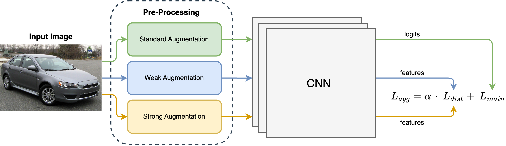

# Extract More from Less: Efficient Fine-Grained Visual Recognition in Low-Data Regimes


## Approach

<p align="center"> 

</p>

> **<p align="justify"> Abstract:** *The emerging task of fine-grained image classification in low-data regimes assumes the presence of low inter-class variance and large intra-class variation along with a highly limited amount of training samples per class. However, traditional ways of separately dealing with fine-grained categorisation and extremely scarce data may be inefficient under both these harsh conditions presented together. In this paper, we present a novel framework, called AD-Net, aiming to enhance deep neural network performance on this challenge by leveraging the power of Augmentation and Distillation techniques. Specifically, our approach is designed to refine learned features through self-distillation on augmented samples, mitigating harmful overfitting. We conduct comprehensive experiments on popular fine-grained image classification benchmarks where our AD-Net demonstrates consistent improvement over traditional fine-tuning and state-of-the-art low-data techniques. Remarkably, with the smallest data available, our framework shows an outstanding relative accuracy increase of up to 45 % compared to standard ResNet-50 and up to 27 % compared to the closest SOTA runner-up. We emphasise that our approach is practically architecture-independent and adds zero extra cost at inference time. Additionally, we provide an extensive study on the impact of every framework’s component, highlighting the importance of each in achieving optimal performance.* </p>


## Main Contributions
1) We introduce a simple yet effective  architecture-independent approach to improve the performance of models at FGVC under low data regime.
2) Our proposed low-data framework includes two feature distillation branches for model purification both using randomly cropped inputs, which provides explicit regularisation while not relying on any extra module.
3) Our extensive experiments on three popular FGVC datasets (CUB, Stanford Cars, and FGVC-Aircraft) demonstrate that our approach achieves state-of-the-art results on FGVC in low data regimes.
4) Our solution allows the model to learn and refine representations by enriching the variability of the training data through extra augmented image views.


<hr />


# 🐘 Model Zoo

### Main Models

The pre-trained models can be found here: [models](https://mbzuaiac-my.sharepoint.com/:f:/g/personal/dmitry_demidov_mbzuai_ac_ae/EnMOkgG7VQlKmvBOndirZ3IBc-L9u0uwWBYjszZn8YHOOw?e=T9y1B1)


<hr />


# 🧋 How to start

## Installation

#### Create environment:

pip:

```
python3 -m venv env
source env/bin/activate
pip install -r requirements_pip.txt
```

conda:

1. With environment.yml:

```
conda env create -f environment.yml
```

2. With requirements.txt:

```
conda create --name <env> --file requirements_conda.txt
```


## Training and Evaluation


#### Run:

1. Initialise the code space:

```
cd '/path/to/cloned/repo/'

bash init.sh 

conda activate ffvt_u2n_p36
```

2. Run (example):

Ours:
```
python3 -W ignore train.py --dataset CUB --model_type cnn --model_name resnet50 --img_size 224 --resize_size 256 --train_batch_size 24 --eval_batch_size 24 --learning_rate 0.03 --num_steps 40000 --fp16 --eval_every 200 --split 10 --aug_type double_crop
```

Vanilla:
```
python3 -W ignore train.py --dataset CUB --model_type cnn --model_name resnet50 --img_size 224 --resize_size 256 --train_batch_size 24 --eval_batch_size 24 --learning_rate 0.03 --num_steps 40000 --fp16 --eval_every 200 --split 10 --lr_ratio 1.0 --vanilla
```

<hr />


# 🆕 News
* **(Nov 16, 2024)** 
  * Repo description added (README.md).
  * Training and evaluation code is released.
  * Code instructions were added.

* **(Dec 7, 2024)** 
  * Pretrained models were released.

* **(Soon)** 
  * Optimisation

<hr />


# 🖋️ Credits

## Citation
In case you would like to utilise or refer to our approach (source code, trained models, or results) in your research, please consider citing:

```
@misc{demidov2024extractlessefficientfinegrained,
      title={Extract More from Less: Efficient Fine-Grained Visual Recognition in Low-Data Regimes}, 
      author={Dmitry Demidov and Abduragim Shtanchaev and Mihail Mihaylov and Mohammad Almansoori},
      year={2024},
      eprint={2406.19814},
      archivePrefix={arXiv},
      primaryClass={cs.CV},
      url={https://arxiv.org/abs/2406.19814}, 
}
```

## Contacts
In case you have a question or suggestion, please create an issue or contact us at _dmitry.demidov@mbzuai.ac.ae_ .

## Acknowledgements
Our code is partially based on [ViT-pytorch](https://github.com/jeonsworld/ViT-pytorch) repository and we thank the corresponding authors for releasing their code. If you use our derived code, please consider giving credits to these works as well.
